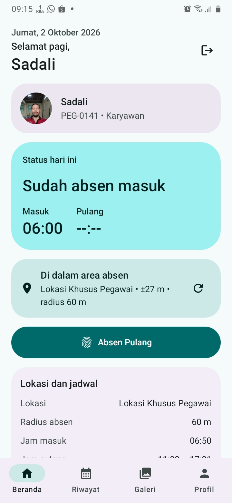
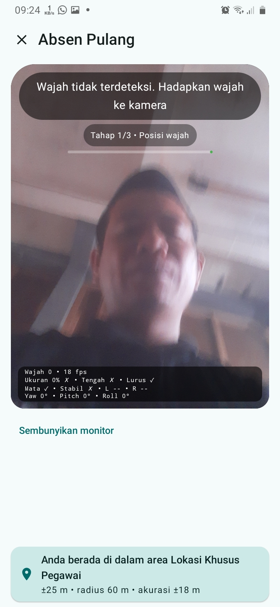
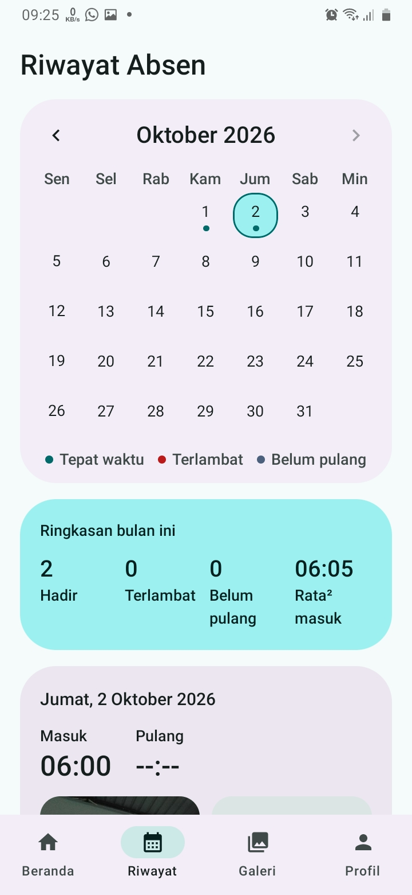

# Absen Marsa

Aplikasi absensi Android untuk pegawai sekolah. Absen masuk dan pulang dari HP: lokasi dicek otomatis, wajah diverifikasi, dan riwayat tercatat rapi.

  
  
  

## Unduh

Unduh APK terbaru di **[halaman unduhan](https://smk-maarif9kebumen.com/download/)** atau di tab **Actions** repo ini (artifact `AbsenMarsa-release`).

Syarat: Android 8.0 ke atas, kamera depan, GPS, dan koneksi internet.

## Fitur

- **Lokasi dicek lebih dulu.** Jarak ke lokasi kerja diperiksa saat beranda dibuka, jadi kamera langsung muncul saat kamu menekan Absen.
- **Verifikasi wajah.** Satu gerakan acak (kedip, toleh kiri, toleh kanan, atau senyum), lalu foto diambil otomatis.
- **Pemeriksaan foto.** Foto buram, terlalu gelap atau terang, mata tertutup, atau tidak menghadap lurus ditolak sebelum dikirim. Hasil akhir berupa foto potret 360x480.
- **Riwayat kalender.** Hari hadir, terlambat, dan belum pulang, plus ringkasan bulan dan foto masuk dan pulang.
- **Galeri kehadiran.** Lihat siapa saja yang hadir pada tanggal tertentu.
- **Profil dan tema.** Terang, gelap, AMOLED, dan warna dinamis (Android 12 ke atas). Pilihan tersimpan.
- **Aman dari kecurangan sederhana.** Lokasi palsu (mock location) terdeteksi dan ditolak.

## Cara memasang

1. Unduh file APK dan buka dari HP.
2. Jika diminta, izinkan pemasangan dari sumber ini (Pengaturan, Pasang aplikasi tidak dikenal).
3. Jika muncul peringatan Play Protect, pilih **Tetap pasang**, lalu **Buka**.
4. Login, lalu izinkan **Lokasi (Lokasi tepat)** dan **Kamera**.

## Cara memakai

**Absen masuk**
1. Buka tab Beranda dan pastikan kartu lokasi menampilkan "Di dalam area absen".
2. Tekan **Absen Masuk**. Ikuti instruksi di atas kamera: posisikan wajah di oval, lakukan satu gerakan, lalu tahan lurus.
3. Foto diambil otomatis dan diperiksa. Jika lolos, periksa hasilnya lalu tekan **Kirim absen**.

**Absen pulang.** Tombolnya aktif setelah jam pulang pada jadwalmu. Alurnya sama dengan absen masuk.

**Riwayat dan galeri.** Buka tab Riwayat untuk kalender bulananmu, dan tab Galeri untuk kehadiran semua pegawai per tanggal.

## Tanya jawab

**Absen ditolak karena di luar area.** Aktifkan GPS, pilih "Lokasi tepat", tunggu akurasi membaik, atau dekati titik lokasi kerja. Matikan aplikasi lokasi palsu.

**Foto terus ditolak.** Cari cahaya cukup, hadap lurus, buka mata, dan bersihkan lensa depan. Jangan bergerak saat foto diambil.

**Tombol Absen Pulang belum aktif.** Tombol mengikuti jam pulang di profil jadwalmu. Labelnya menunjukkan jam mulai.

**Cara memperbarui.** Pasang APK terbaru di atas versi lama. Data login tetap aman selama APK ditandatangani dengan kunci yang sama.

## Untuk pengembang

- **Stack:** Kotlin, Jetpack Compose, Material 3, Hilt, Retrofit dan OkHttp, kotlinx.serialization, DataStore, CameraX, ML Kit Face Detection, Fused Location, Coil.
- **Arsitektur:** MVVM dengan lapisan `data` (remote, local, repository), `domain` (model), dan `ui` (screen).
- **Build:** push ke `main` memicu GitHub Actions (`.github/workflows/build.yml`) yang menghasilkan APK debug dan rilis.
- **Penandatanganan rilis:** isi empat Secrets: `KEYSTORE_BASE64`, `KEYSTORE_PASSWORD`, `KEY_ALIAS`, `KEY_PASSWORD`. Tanpa Secrets, APK rilis memakai kunci debug (hanya untuk uji). Simpan file keystore di tempat aman dan jangan pernah mengunggahnya ke repo.
- **Mengubah server:** ubah `BASE_URL` di `data/remote/ApiConfig.kt`.

## Kredit

Desain antarmuka terinspirasi dari [Driftly](https://github.com/dp-hridayan/Driftly). Kode aplikasi ditulis sendiri untuk kebutuhan sekolah.
